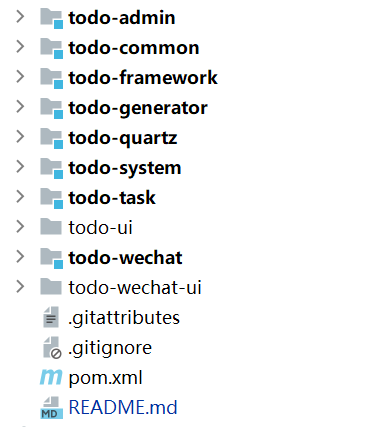
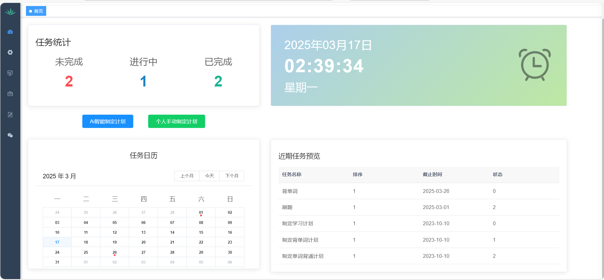
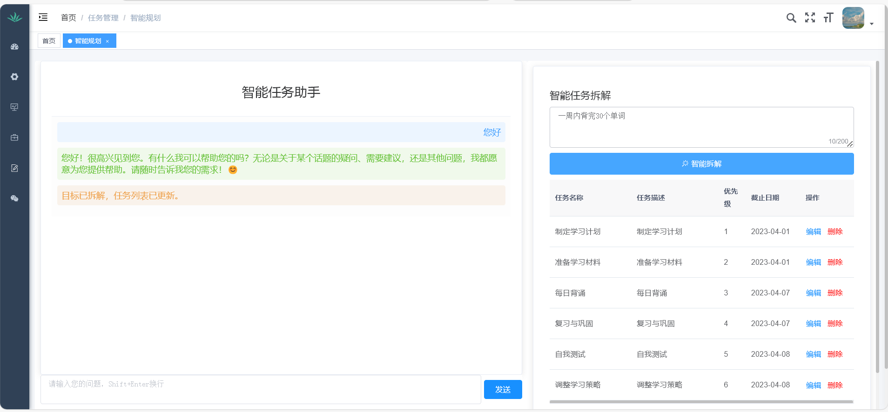
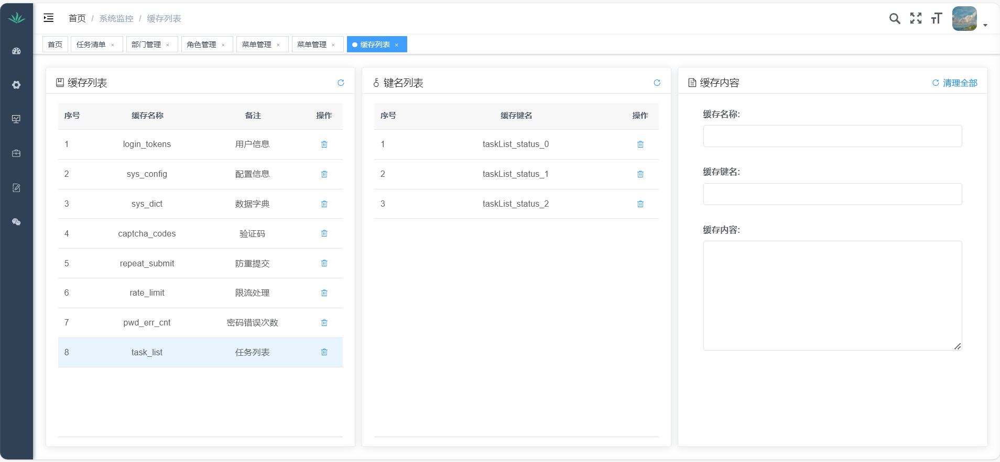
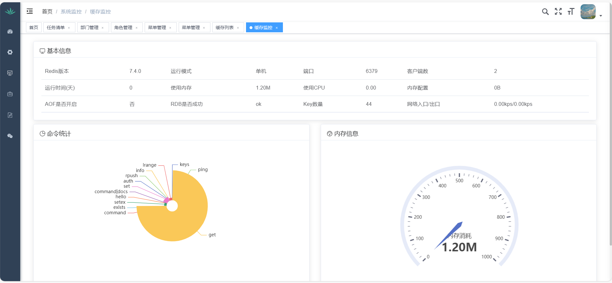
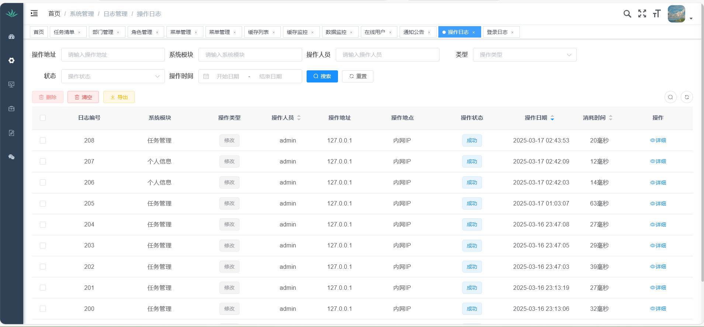
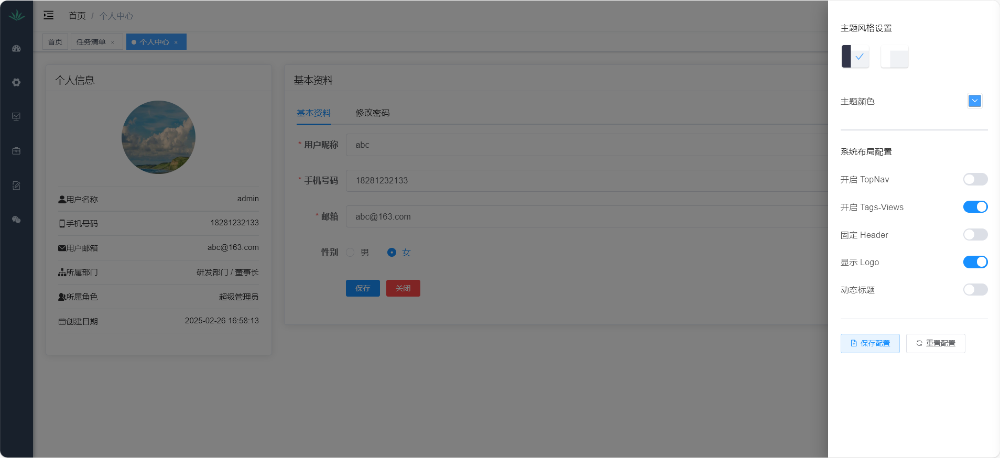
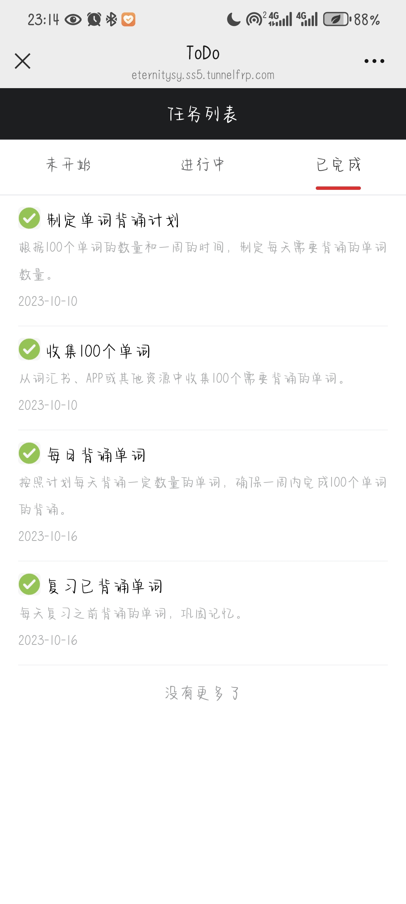

# ToDo - 基于DeepSeek的智能规划系统
## (Vue2 + SpringBoot + MyBatis + MySQL + Redis + Spring Security +Spring Scheduler)

------
### **一、 项目定位与需求分析**

- **目标**：
  - 构建一个便捷、易于理解且可读性强的平台，利用 DeepSeek 的搜索与问答能力，将大段文字内容“解构”成结构化、分类化的信息，方便用户快速定位关键内容。
- **用户需求**：
  - 现有平台返回的大段文字往往冗长、不易浏览。用户更希望看到经过关键词提取、摘要、分类后的信息，以便于快速理解和决策。
------

### **二、 技术思路与方案**

- **基于若依开发框架搭建**
  - 利用若依框架完成基础平台搭建。
- **搜索与问答**：
  - 调用 DeepSeek 的 API，根据用户的关键词或自然语言查询，获取相关内容和答案。

- **文本解析与结构化**：
  - 利用 DeepSeek 返回的长文本，再进行自然语言处理（NLP）任务，比如关键词抽取、摘要生成、实体识别等。
  - 将这些处理后的信息组织成结构化数据，如 JSON 格式，方便前端展示或后续查询。
------
### **三、 目录结构**

------
### **四、 部分功能页面展示**

### 后端系统界面
* #### 首页任务统计

* #### 智能规划功能

* #### 任务列表

* #### 缓存列表

* #### 缓存监控

* #### 操作日志

* #### 个人中心和布局设计

#### 微信公众号界面
* ##### 任务列表功能

* #### 消息推送功能

