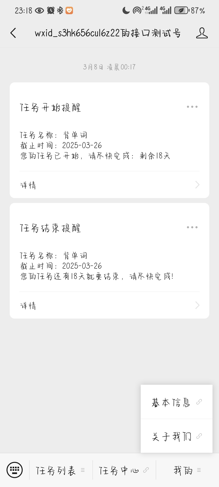

# ToDo
 基于deepseek的智能规划系统
### (Vue2 + SpringBoot + MyBatis + MySQL + Redis)

### 主要功能：

### 部分功能页面展示：
##### 微信公众号界面
* ##### 任务列表功能

* #### 消息推送功能

#### 后端系统界面
* #### 首页任务统计

* #### 借书列表

* #### 还书列表

* #### 图书添加

* #### 图书列表

* #### 图书编辑

* #### 会员添加

* #### 会员列表

* #### 管理员列表

* #### 图书分类列表

