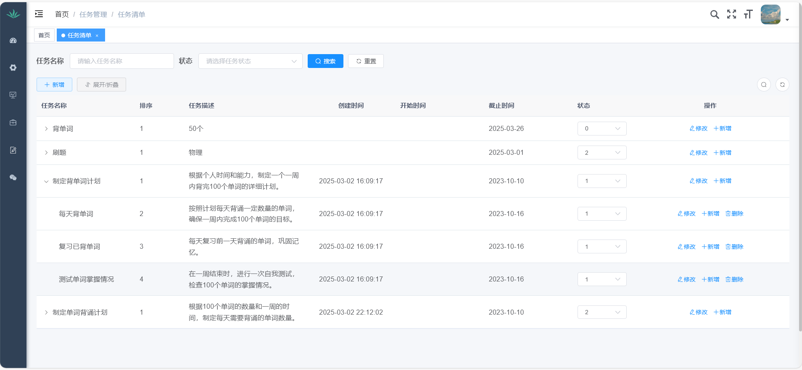

# ToDo
 基于deepseek的智能规划系统
### (Vue2 + SpringBoot + MyBatis + MySQL + Redis)

### 主要功能：

### 部分功能页面展示：

#### 后端系统界面
* #### 首页任务统计

* #### 智能规划功能

* #### 任务列表

* #### 缓存列表

* #### 缓存监控

* #### 操作日志

* #### 个人中心和布局设计

##### 微信公众号界面
* ##### 任务列表功能

* #### 消息推送功能

